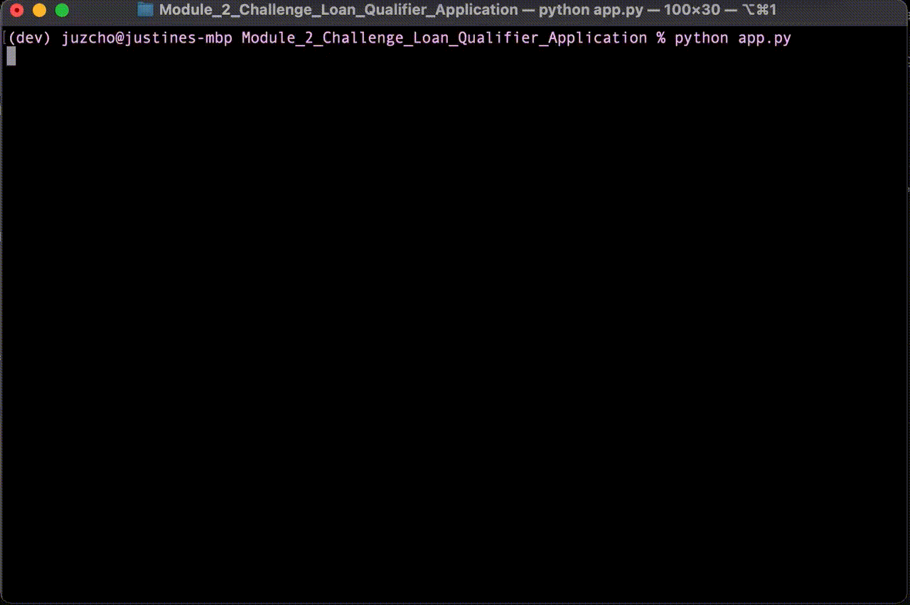

# **Loan Qualifier Application**

## Loan Qualifier 

The Loan Qualifier project is about getting qualified loans for the user based on their credit rating, income, debt and loan information. 

The user was having a hard time reviewing and reading their qualified loans through the software's interface. So they have asked the company to add a feature to externally download and save their loan data.

---

## Technologies

Describe the technologies required to use your project such as programming languages, libraries, frameworks, and operating systems. Be sure to include the specific versions of any critical dependencies that you have used in the stable version of your project.

This project leverages **[python version 3.8.5](https://www.python.org/downloads/)** with the following packages and modules:

* [fire](https://github.com/google/python-fire) - *version 0.4.0* - This allows us to execute any fuction defined in a python file, using the terminal/ Command Line Interface so that you can call the function while on the terminal.*

* [questionary](https://github.com/tmbo/questionary) - *version 1.9.0* - For interactive user prompts and dialogs. This was used to create interactive question inputs in the terminal for users to answer, and it will flter qualified loans suited to the user's inputs.  

* [pytest](https://docs.pytest.org/en/stable/) - *version 6.2.3* - This was used as a testing tool to allow us to test our user defined functions following the unit testing process of arrange, act and assert. Unit test allows us to make our functionality more robust.

* [sys Module](https://docs.python.org/3/library/sys.html) - This was used specifically for its sys.exit()funciton which was used to exit the program back to its command prompt. 
The sys module provides functions and variables used to manipulate different parts of the Python runtime environment. You will learn some of the important features of this module here.

* [pathlib](https://docs.python.org/3/library/pathlib.html) - This was used to locate through the directory or file path. Also, it converts a string and converts that supplied string as a PosixPath that can be utilize by other functions such as reading or writing files to csv files.

* [csv](https://docs.python.org/3/library/csv.html) - This was used to be able to read and write csv files easier and that each csv data are separated by a comma.
---

## Installation Guide

In this section, you should include detailed installation notes containing code blocks and screenshots.

```python
  pip install fire
  pip install questionary
  pip install pytest
 
```

On the terminal, under the conda dev environment, install the following:
 * Questionary

    `pip install questionary`

    

* Python Fire

    `pip install fire`

    

* Pytest

    `pip install pytest`

    


---

## Examples

This gif below shows how the loan qualifier works for the user.


---

## Usage


1. To use the loan qualifier application, open your terminal and you have to run the following:

    `python app.py`


2. This should prompt you to enter a file path: 
    
    ` ./data/daily_rate_sheet.csv`


3. Then as a user, type in your credit score, your monthly debt, your monthly income, your loan amount and your home value.

4. Then, this will calculate your debt-to-income ratio and your loan-to-value ratio, as well as how many qualifying loans you are qualified for, if any. 

    4.1. If you are qualified for any loans, this will also prompt you whether you'd like to save your loans to a csv file, if so, then it will ask you for a filename. If you do not qualify for any loans, then the program will exit.
    
    * Check screenshot below: 
    
    

---

## Contributors


This is brought to you by ET Home Loans.

Contributed by: Justine Cho

Email: juz317_cho@yahoo.com

[ LinkedIn](https://www.linkedin.com/in/justinecho)

---

## License

### **MIT License**

Copyright (c) [2021] [Justine Cho]

Permission is hereby granted, free of charge, to any person obtaining a copy
of this software and associated documentation files (the "Software"), to deal
in the Software without restriction, including without limitation the rights
to use, copy, modify, merge, publish, distribute, sublicense, and/or sell
copies of the Software, and to permit persons to whom the Software is
furnished to do so, subject to the following conditions:

The above copyright notice and this permission notice shall be included in all
copies or substantial portions of the Software.

THE SOFTWARE IS PROVIDED "AS IS", WITHOUT WARRANTY OF ANY KIND, EXPRESS OR
IMPLIED, INCLUDING BUT NOT LIMITED TO THE WARRANTIES OF MERCHANTABILITY,
FITNESS FOR A PARTICULAR PURPOSE AND NONINFRINGEMENT. IN NO EVENT SHALL THE
AUTHORS OR COPYRIGHT HOLDERS BE LIABLE FOR ANY CLAIM, DAMAGES OR OTHER
LIABILITY, WHETHER IN AN ACTION OF CONTRACT, TORT OR OTHERWISE, ARISING FROM,
OUT OF OR IN CONNECTION WITH THE SOFTWARE OR THE USE OR OTHER DEALINGS IN THE
SOFTWARE.
